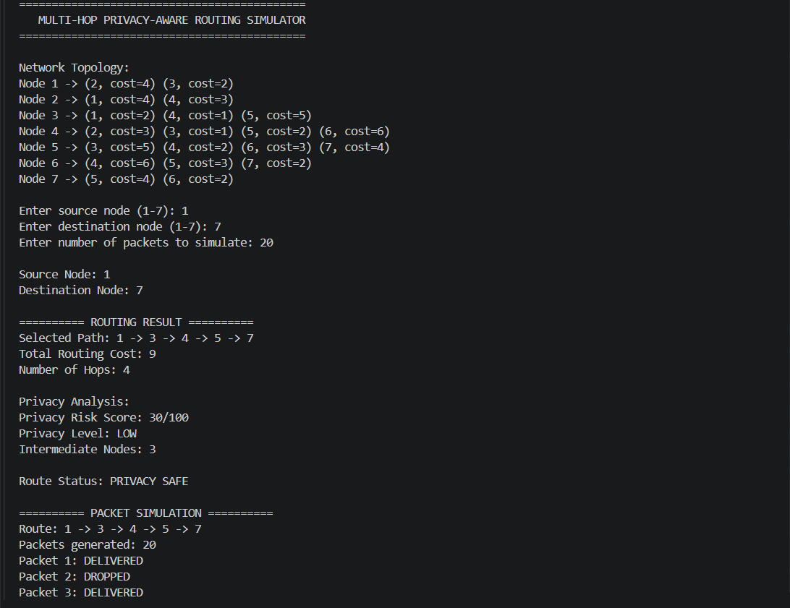
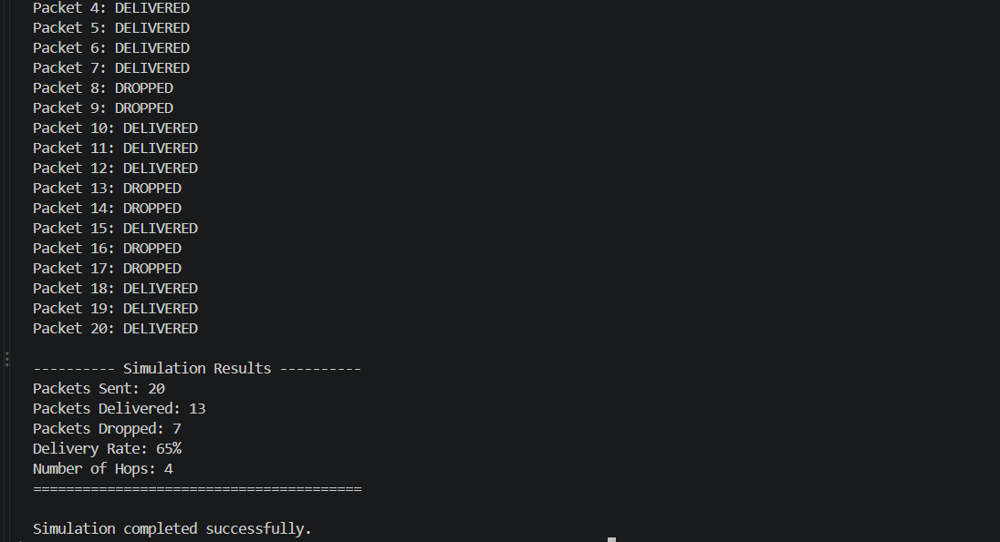

# 🔐 Multi-Hop Privacy-Aware Routing Simulator

A Computer Networks project that simulates multi-hop packet routing while considering routing cost, privacy risk, and packet delivery performance.

---

## 📌 Overview

The **Multi-Hop Privacy-Aware Routing Simulator** models a computer network as a weighted graph in which nodes represent network devices and edges represent communication links.

The simulator:

1. Loads a network topology from a configuration file.
2. Accepts a source node, destination node, and number of packets from the user.
3. Uses Dijkstra's algorithm to determine a minimum-cost route.
4. Evaluates the selected route using a simple privacy-risk model.
5. Simulates packet transmission across the selected multi-hop route.
6. Reports packet delivery, packet loss, delivery rate, routing cost, and number of hops.

> **Note:** The privacy model used in this project is an educational simulation metric. It does not represent a real-world anonymity, encryption, or cryptographic privacy guarantee.

---

## 🎯 Objectives

- Understand graph-based network routing.
- Implement Dijkstra's shortest-path algorithm.
- Simulate multi-hop communication between network nodes.
- Introduce a simple privacy-risk evaluation mechanism.
- Simulate packet delivery and packet loss.
- Measure basic network performance metrics.
- Demonstrate Computer Networks concepts through a practical simulator.

---

## ✨ Features

- Weighted network topology
- Multi-hop routing
- Dijkstra's shortest-path algorithm
- User-defined source and destination
- User-defined packet count
- Privacy-risk evaluation
- Privacy-safe route checking
- Packet delivery simulation
- Packet drop simulation
- Delivery-rate calculation
- Number-of-hops calculation
- Routing-cost calculation
- External network configuration through `network.txt`
- Input validation

---

## 🧠 Algorithms and Concepts

### 1. Graph Representation

The network is represented using a weighted graph with an adjacency-list structure.

Each network connection contains:

- Source node
- Destination node
- Link cost

Example:

```text
1 2 4
```

This represents a connection between Node 1 and Node 2 with a link cost of 4.

---

### 2. Dijkstra's Algorithm

Dijkstra's algorithm is used to find a minimum-cost path between the selected source and destination nodes.

The implementation maintains:

- Distance values
- Parent nodes
- A priority queue

After calculating the minimum-cost route, the parent information is used to reconstruct the complete path.

Example:

```text
Source → Node 3 → Node 4 → Node 5 → Destination
```

---

### 3. Privacy-Risk Model

The simulator uses a simple project-specific privacy-risk model.

The simulated risk is influenced by:

- Number of intermediate nodes
- Length of the selected route

A route containing more intermediate routing points receives a higher simulated privacy-risk score.

The score is represented on a scale from:

```text
0 - 100
```

The simulator categorizes the result as:

- **LOW**
- **MEDIUM**
- **HIGH**

This model is intended to demonstrate the concept of privacy-aware routing rather than provide a real-world privacy measurement.

---

### 4. Packet Simulation

After a route is selected, packets are simulated across the multi-hop path.

Each hop has a small simulated probability of packet loss.

The simulator reports:

- Packets sent
- Packets delivered
- Packets dropped
- Delivery rate
- Number of hops

Packet loss is randomized, so simulation results can vary between executions.
## 🌐 Network Architecture

The network is represented as interconnected nodes.

Example topology:

```text
             Node 2
            /      \
        Node 1     Node 4
           \       /    \
            Node 3      Node 6
               \       /    \
                Node 5       Node 7
```

The network topology is defined in:

```text
data/network.txt
```

The simulator can therefore use a different topology by modifying the configuration file rather than changing the C++ source code.

---

## 📊 Simulation Metrics

### Routing Cost

The total cost of all links used by the selected route.

### Number of Hops

The number of network links traversed between the source and destination.

### Packets Sent

The total number of packets generated for the simulation.

### Packets Delivered

The number of packets that successfully reach the destination.

### Packets Dropped

The number of packets that fail during transmission.

### Delivery Rate

The percentage of generated packets successfully delivered.

```text
Delivery Rate =
(Packets Delivered / Packets Sent) × 100
```

### Privacy Risk

A project-specific score representing the simulated routing exposure associated with the selected path.

---

## 🛠️ Technologies Used

- **C++**
- **Standard Template Library (STL)**
- **Graph Data Structures**
- **Dijkstra's Algorithm**
- **File Handling**
- **Randomized Simulation**
- **Git**
- **GitHub**

---

## 📁 Project Structure

```text
Multi-Hop-Privacy-Aware-Routing-Simulator/
│
├── src/
│   ├── main.cpp
│   ├── graph.h
│   ├── graph.cpp
│   ├── routing.h
│   ├── routing.cpp
│   ├── privacy.h
│   ├── privacy.cpp
│   ├── simulator.h
│   └── simulator.cpp
│
├── data/
│   └── network.txt
│
├── screenshots/
│   └── simulation-output.png
│
├── README.md
└── .gitignore
```

---

## ▶️ How to Run

### Prerequisites

Install a C++ compiler such as **GCC/MinGW-w64** and make sure `g++` is available from the terminal.

Check the compiler installation:

```bash
g++ --version
```

### 1. Clone the Repository

```bash
git clone https://github.com/YOUR-USERNAME/Multi-Hop-Privacy-Aware-Routing-Simulator.git
```

Replace `YOUR-USERNAME` with your GitHub username.

### 2. Open the Project

```bash
cd Multi-Hop-Privacy-Aware-Routing-Simulator
```

### 3. Compile

From the project root directory:

```bash
g++ src/main.cpp src/graph.cpp src/routing.cpp src/privacy.cpp src/simulator.cpp -o routing_simulator
```

### 4. Run

On Windows:

```bash
.\routing_simulator.exe
```

---

## 💻 Example Input

The simulator asks the user for the source node, destination node, and number of packets.

Example:

```text
Enter source node (1-7): 1
Enter destination node (1-7): 7
Enter number of packets to simulate: 20
```
## 📈 Example Output

Example output may look like:

```text
============================================
   MULTI-HOP PRIVACY-AWARE ROUTING SIMULATOR
============================================

Network Topology:

Node 1 -> (2, cost=4) (3, cost=2)
Node 2 -> (1, cost=4) (4, cost=3)
Node 3 -> (1, cost=2) (4, cost=1) (5, cost=5)
Node 4 -> (2, cost=3) (3, cost=1) (5, cost=2) (6, cost=6)
Node 5 -> (3, cost=5) (4, cost=2) (6, cost=3) (7, cost=4)
Node 6 -> (4, cost=6) (5, cost=3) (7, cost=2)
Node 7 -> (5, cost=4) (6, cost=2)

Source Node: 1
Destination Node: 7

========== ROUTING RESULT ==========

Selected Path: 1 -> 3 -> 4 -> 5 -> 7
Total Routing Cost: 9
Number of Hops: 4

Privacy Analysis:
Privacy Risk Score: 20/100
Privacy Level: LOW

Route Status: PRIVACY SAFE

========== PACKET SIMULATION ==========

Packets Sent: 20
Packets Delivered: 18
Packets Dropped: 2
Delivery Rate: 90%
Number of Hops: 4

Simulation completed successfully.
```

> Packet delivery and packet-loss results may vary between executions because packet loss is simulated randomly.

---

## 📚 Syllabus Mapping

The project demonstrates concepts related to the Computer Networks syllabus.

| Syllabus Concept | Project Application |
|---|---|
| Dijkstra's Algorithm | Minimum-cost route selection |
| Graph-based Networks | Network topology representation |
| Routing | Multi-hop path selection |
| Distance Vector Routing Concepts | Routing and path-cost concepts |
| Packet Transmission | Packet simulation |
| Packet Loss | Simulated packet drops |
| Network Performance | Delivery rate and routing metrics |
| Network Simulation | End-to-end routing simulation |

The project extends these networking concepts with a project-specific privacy-risk model.

---

## 🚀 Future Enhancements

Possible future improvements include:

- Distance Vector Routing implementation
- Dynamic routing-table updates
- Leaky Bucket congestion-control simulation
- Multiple routing strategies
- Dynamic network topology
- Configurable packet-loss probability
- Node failure simulation
- Graphical network visualization
- Real-time packet animation
- More advanced privacy mechanisms
- NS-2/NS-3 based simulation

---

## 👥 Contributors

Add the names of all project members below.

- M.Jaya Varshini - 24WH1A05X1
- K.Gayatri - 24WH1A05X4
- Y.Sherly Leona - 24WH1A05X5
- J.Aashika - 24WH1A05X7


---

## 📜 Academic Project

This project was developed as part of a **Computer Networks academic project** to demonstrate graph-based routing, shortest-path algorithms, multi-hop communication, packet transmission, network simulation, and privacy-aware routing concepts.

## 📈 Example Output




